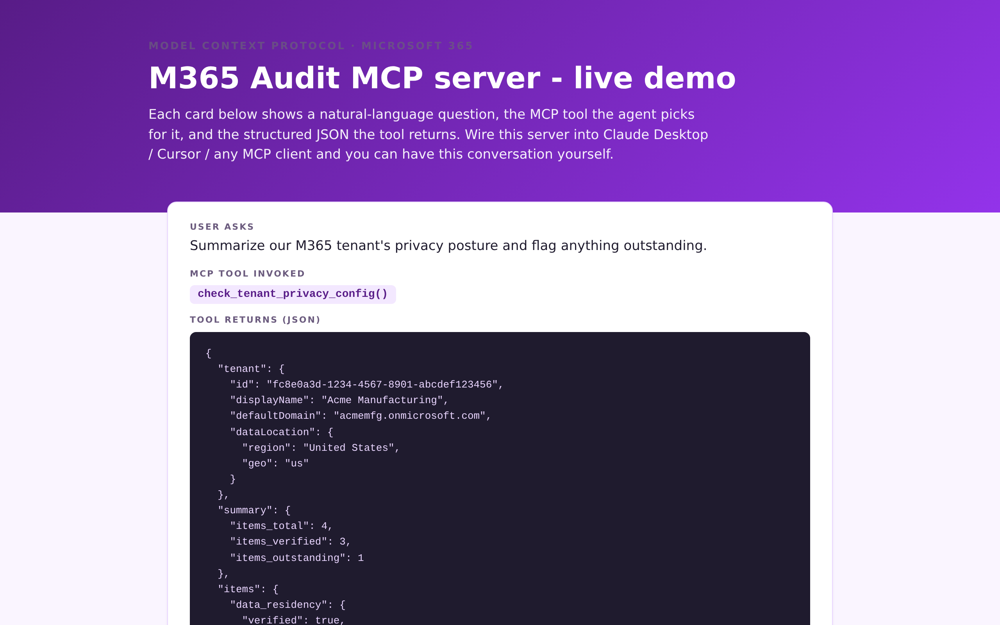
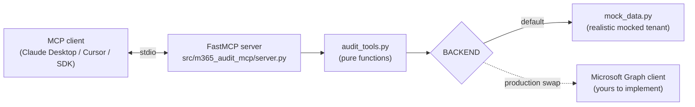

# M365 Audit MCP server

[](https://github.com/derekgallardo01/m365-audit-mcp/actions/workflows/ci.yml) [](LICENSE) [](#) [](https://codespaces.new/derekgallardo01/m365-audit-mcp)

**Docs:** [Getting started](docs/getting-started.md) · [Architecture](docs/architecture.md) · [Customization](docs/customization.md) · [Evaluation](docs/evaluation.md) · [Diagrams](docs/diagrams.md) · [FAQ](docs/faq.md)

**Live demo:** [derekgallardo01.github.io/m365-audit-mcp](https://derekgallardo01.github.io/m365-audit-mcp/) — sample question + tool invocation + JSON response for each of the 5 tools, regenerated on every push.

[](https://derekgallardo01.github.io/m365-audit-mcp/)

[Full-page capture (all 5 tools) →](docs/screenshots/01-overview-fullpage.png)

An [MCP](https://modelcontextprotocol.io) server that exposes Microsoft 365
privacy / compliance audit checks as tools any MCP client (Claude Desktop,
Cursor, VS Code, custom Agent SDK builds) can call.

Default backend is a realistic mocked tenant — so the server runs anywhere,
zero credentials, zero setup. The production seam swaps to Microsoft Graph
without changing the tool surface.

```bash
pip install -e .
m365-audit-mcp     # runs the MCP server over stdio
```

```bash
python -m pytest -q     # 11 unit tests covering every tool
```

Stdlib-only Python except for the `mcp` SDK itself. No real M365 tenant
required to develop against.

## Run in Docker

```bash
docker build -t m365-audit-mcp .
docker run --rm m365-audit-mcp python -m pytest -q       # run tests in the image
docker run --rm -i m365-audit-mcp                        # run the server (stdio)
```

For Claude Desktop / Cursor integration, prefer the `pip install -e .`
path on the host — MCP clients launch the server as a subprocess and
talk to it via pipes, which is awkward through Docker. The Dockerfile
is for CI, packaging, and remote-hosted deployments.

## Example: production scenario

**[examples/tenant_health_report.py](examples/tenant_health_report.py)** — Calls all 5 audit tools directly (skipping MCP transport) and builds an executive markdown tenant-health report with the top 3 priority actions surfaced

```bash
python examples/tenant_health_report.py
```

## What it's for

When you're running an M365 / Copilot rollout, the questions that come up
weekly are the same: "is our tenant configured correctly?", "what
SharePoint documents are orphaned?", "are our Conditional Access policies
actually enforcing or still in report-only?", "where is Copilot adoption
stalling?"

This MCP server lets you chat them in Claude / Cursor instead of
clicking through the M365 admin centre, and returns structured data the
LLM can summarise, compare, or paste straight into a sign-off doc.

## Tools

| Tool | What it returns | Typical question |
|---|---|---|
| `check_tenant_privacy_config` | Tenant metadata + per-item verification status mirroring the [m365-privacy-config checklist](https://github.com/derekgallardo01/m365-privacy-config) | "Are we configured to keep client data in-tenant?" |
| `find_orphaned_documents` | Documents with no owner OR not accessed in N days, each with a recommendation | "What's at risk to leak into Copilot grounding?" |
| `audit_conditional_access_policies` | All CA policies; flags any not in `enabled` state | "Are any of our policies still report-only?" |
| `list_dlp_policies` | DLP policies, optionally filtered by location | "What's covering Teams chats?" |
| `summarize_copilot_usage` | Tenant-wide or per-team Copilot adoption stats | "Where is rollout stalling?" |

Each tool returns JSON-serializable dicts. The LLM consumes them and turns
them into natural language for the human, or chains tool calls (e.g.
"list low-adoption teams, then for each one summarize their top prompts").

## How to wire into Claude Desktop

Add to your Claude Desktop config:

```json
{
  "mcpServers": {
    "m365-audit": {
      "command": "m365-audit-mcp"
    }
  }
}
```

Restart Claude Desktop. The five tools appear in the tool list — Claude
can now answer questions like *"summarize our tenant's privacy posture
and flag anything outstanding"* by calling `check_tenant_privacy_config`
without any further prompting from you.

The exact same config shape works in Cursor, in custom Agent SDK builds,
and in any MCP client that supports stdio transport.

## Architecture



- `server.py` is a thin FastMCP wrapper — registers each tool, hands off
  to the pure function in `audit_tools.py`.
- `audit_tools.py` does the work. Each function is testable directly
  without touching the MCP transport (that's how all 11 tests work).
- `mock_data.py` returns realistic tenant-shaped data. To swap in real
  Microsoft Graph, replace the `BACKEND` constant in `audit_tools.py`
  with a Graph client wrapper that returns the same shape. No other code
  changes.

## Bringing it to a real tenant

The `BACKEND` swap point in `audit_tools.py` is the single integration
point. A production replacement would:

1. Implement a `GraphBackend` class with the same attributes (`TENANT`,
   `PRIVACY_CONFIG`, `DOCUMENTS`, `CONDITIONAL_ACCESS_POLICIES`, etc.)
   but populated from Microsoft Graph queries instead of constants.
2. Use an Entra ID app registration with the minimum scopes per tool
   (`User.Read.All`, `Directory.Read.All`, `Policy.Read.All`,
   `Reports.Read.All`, `Sites.Read.All`).
3. Cache aggressively — Graph quotas are real, and audit queries don't
   need second-by-second freshness.

The mocked default lets you develop and demo the integration into an
agent (Claude Desktop or otherwise) without ever touching a real tenant.

## What's inside

| Path | Purpose |
|---|---|
| `src/m365_audit_mcp/server.py` | FastMCP server registering 5 tools |
| `src/m365_audit_mcp/audit_tools.py` | Pure-function tool implementations |
| `src/m365_audit_mcp/mock_data.py` | Realistic mocked tenant data |
| `tests/test_audit_tools.py` | 11 unit tests (each tool + edge cases) |
| `pyproject.toml` | Python packaging + `m365-audit-mcp` script entry |

## Companion repos

- [m365-privacy-config](https://github.com/derekgallardo01/m365-privacy-config) — the human-readable checklist this MCP server mirrors
- [rag-over-docs-kit](https://github.com/derekgallardo01/rag-over-docs-kit) — pairs naturally if you want to ground answers in your own M365 docs in addition to the audit data
- [copilot-studio-support-agent](https://github.com/derekgallardo01/copilot-studio-support-agent) — the inverse pattern: an agent INSIDE M365, vs. this server SERVING M365 data to an agent outside it
