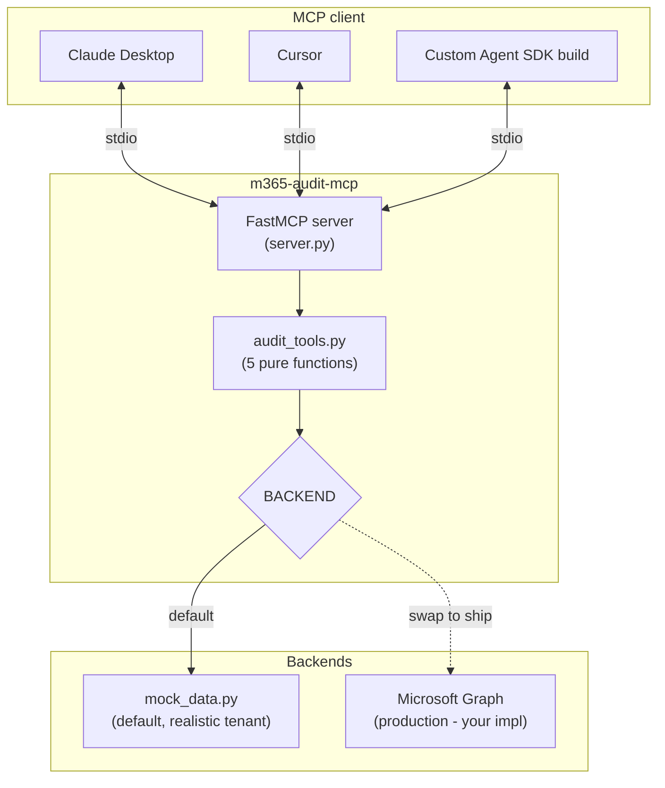
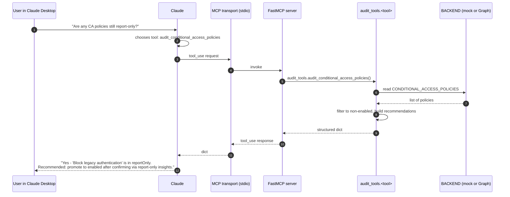

# Architecture

A thin MCP server over a set of pure-function audit tools. The transport
(MCP / stdio) and the data source (mocked tenant / Microsoft Graph) are
both behind swap points so the core logic stays trivially testable.

## Components

| Piece | Lives in | Job |
|---|---|---|
| FastMCP server | [server.py](../src/m365_audit_mcp/server.py) | Thin wrapper. Each `@mcp.tool()`-decorated function delegates to a pure function in `audit_tools.py`. Docstrings are the tool descriptions the LLM reads. |
| Audit tools | [audit_tools.py](../src/m365_audit_mcp/audit_tools.py) | 5 pure functions taking primitives + returning JSON-serializable dicts. No MCP imports. |
| Mock data | [mock_data.py](../src/m365_audit_mcp/mock_data.py) | Realistic tenant-shaped constants. Same shape Microsoft Graph would return. |
| BACKEND constant | [audit_tools.py](../src/m365_audit_mcp/audit_tools.py) | The single integration point. Default = `mock_data`. Production = your Graph client. |

## Turn sequence — tool call from Claude Desktop

## Why the design looks like this

- **MCP is a transport, not a programming model.** Wrapping logic in
  `@mcp.tool()` and ALSO putting the logic inline makes the wrapper hard
  to test. Putting the logic in `audit_tools.py` and having the wrapper
  delegate keeps the test suite fast and the implementation honest. All
  11 tests exercise `audit_tools.py` directly — they never spin up MCP.

- **BACKEND is a constant, not a function arg.** Per-call backend injection
  is more "flexible" but adds a second decision for every consumer. A
  module-level constant matches how production swaps actually happen (one
  edit at deploy time), not how they're imagined ("configure per request").

- **Mock data lives in code, not fixtures.** It's tenant-shaped — same
  fields Microsoft Graph returns — so a developer can read it and know
  what the real call returns. Easier to reason about than JSON fixture
  files when the test fails.

- **Docstrings ARE the tool descriptions.** The MCP protocol passes the
  docstring to the LLM as the tool description. Treat docstrings as
  prompt engineering for the agent. The descriptions in `server.py` are
  specifically written for a Claude consumer.

## Where to look first if something goes wrong

| Symptom | Look here |
|---|---|
| Claude doesn't see the tools | The MCP client config (Claude Desktop's mcp.json). Confirm the `command` resolves on `PATH` after `pip install -e .`. |
| Claude calls the tool but gets an error | Run `python -c "from m365_audit_mcp import audit_tools; print(audit_tools.<tool>())"` directly — bypasses MCP entirely to confirm the function itself works. |
| Output looks wrong | The 11 unit tests cover every tool. Add a case for the wrong-output scenario and fix forward — don't try to debug through MCP. |
| Moving to production — Graph quota errors | The default mocked backend has no rate limit. A real Graph implementation MUST cache aggressively; audit queries don't need sub-second freshness. |
| Want to add a 6th tool | One new function in `audit_tools.py` + one `@mcp.tool()`-decorated wrapper in `server.py` + one test class. Pattern is `summarize_copilot_usage`. |
