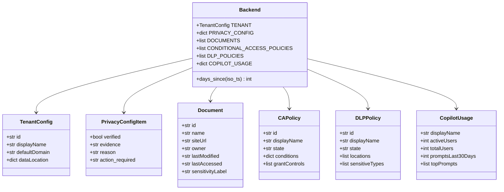
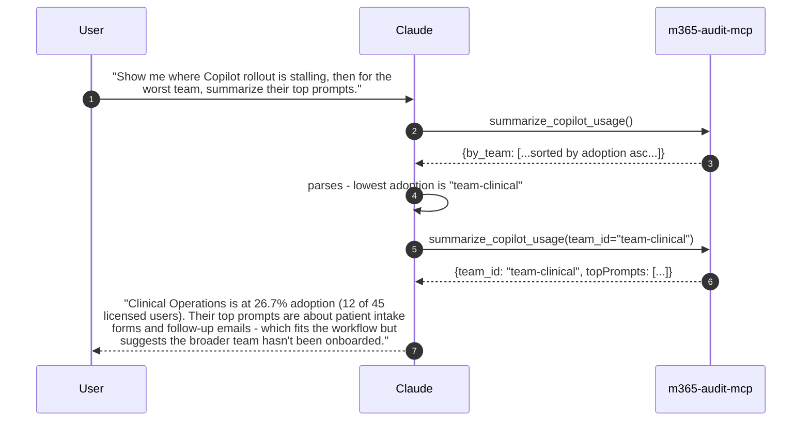
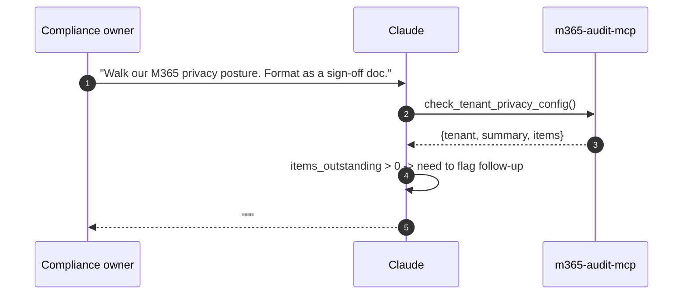
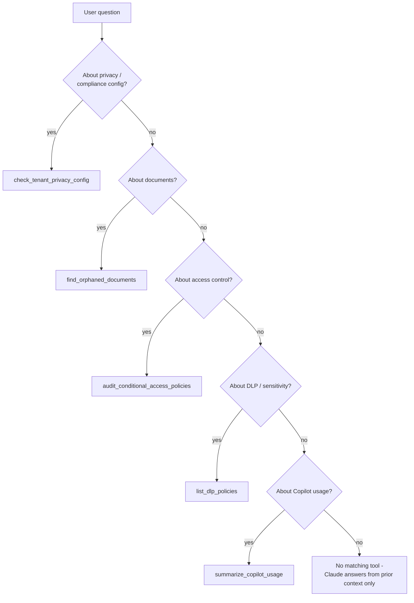
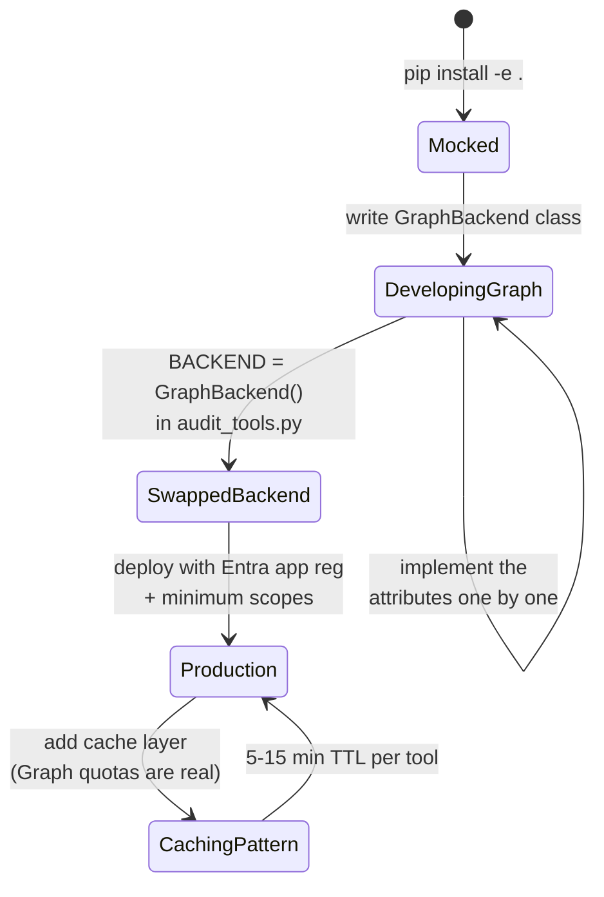

# Diagrams

Beyond the inline ones in [architecture.md](architecture.md).

## 1. Class-ish model — data shapes the tools work with

Both `mock_data` and a real Microsoft Graph backend must expose the same
interface — the audit functions read these attributes by name.

## 2. Sequence — multi-tool conversation in Claude Desktop

The orchestration is the LLM's; the server stays stateless.

## 3. Sequence — privacy audit produces a sign-off doc

## 4. Decision tree — which tool does Claude pick

The LLM does this routing implicitly from tool docstrings. Good docstrings
beat any "select_tool" router function for an MCP server with this few tools.

## 5. State — backend swap (mock → Graph)

The state diagram makes the production-readiness checklist concrete: the
swap is one edit; the caching layer is the work that follows.
